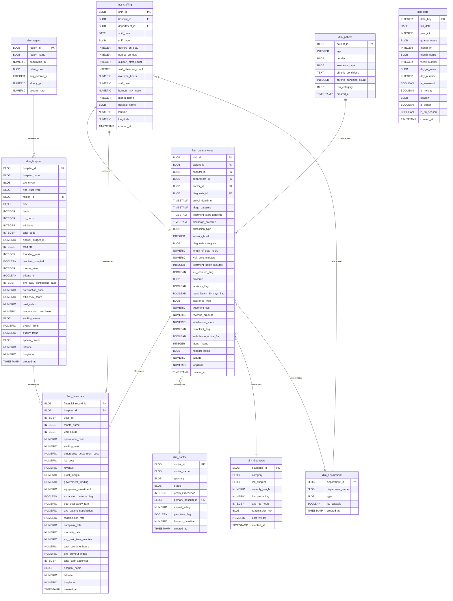

# Diagram documentation

## Summary

- [Diagram documentation](#diagram-documentation)
	- [Summary](#summary)
	- [Introduction](#introduction)
	- [Database type](#database-type)
	- [Table structure](#table-structure)
		- [dim\_date](#dim_date)
		- [dim\_department](#dim_department)
		- [dim\_diagnosis](#dim_diagnosis)
		- [dim\_doctor](#dim_doctor)
		- [dim\_hospital](#dim_hospital)
		- [dim\_patient](#dim_patient)
		- [dim\_region](#dim_region)
		- [fact\_financials](#fact_financials)
			- [Indexes](#indexes)
		- [fact\_patient\_visits](#fact_patient_visits)
		- [fact\_staffing](#fact_staffing)
	- [Relationships](#relationships)
	- [Database Diagram](#database-diagram)

## Introduction

## Database type

- **Database system:** PostgreSQL
## Table structure

### dim_date

| Name              | Type      | Settings                         | References | Note |
| ----------------- | --------- | -------------------------------- | ---------- | ---- |
| **date_key**      | INTEGER   | 🔑 PK, not null                  |            |      |
| **full_date**     | DATE      | not null                         |            |      |
| **year_int**      | INTEGER   | null                             |            |      |
| **quarter_name**  | BLOB      | null                             |            |      |
| **month_int**     | INTEGER   | null                             |            |      |
| **month_name**    | BLOB      | null                             |            |      |
| **week_number**   | INTEGER   | null                             |            |      |
| **day_of_week**   | BLOB      | null                             |            |      |
| **day_number**    | INTEGER   | null                             |            |      |
| **is_weekend**    | BOOLEAN   | null                             |            |      |
| **is_holiday**    | BOOLEAN   | null                             |            |      |
| **season**        | BLOB      | null                             |            |      |
| **is_winter**     | BOOLEAN   | null                             |            |      |
| **is_flu_season** | BOOLEAN   | null                             |            |      |
| **created_at**    | TIMESTAMP | null, default: CURRENT_TIMESTAMP |            |      | 

### dim_department

| Name                | Type      | Settings                         | References | Note |
| ------------------- | --------- | -------------------------------- | ---------- | ---- |
| **department_id**   | BLOB      | 🔑 PK, not null                  |            |      |
| **department_name** | BLOB      | not null                         |            |      |
| **type**            | BLOB      | null                             |            |      |
| **icu_capable**     | BOOLEAN   | null                             |            |      |
| **created_at**      | TIMESTAMP | null, default: CURRENT_TIMESTAMP |            |      | 

### dim_diagnosis

| Name                 | Type         | Settings                         | References | Note |
| -------------------- | ------------ | -------------------------------- | ---------- | ---- |
| **diagnosis_id**     | BLOB         | 🔑 PK, not null                  |            |      |
| **category**         | BLOB         | not null                         |            |      |
| **icd_chapter**      | BLOB         | not null                         |            |      |
| **severity_weight**  | NUMERIC(5,2) | null                             |            |      |
| **icu_probability**  | NUMERIC(5,2) | null                             |            |      |
| **avg_los_hours**    | INTEGER      | null                             |            |      |
| **readmission_risk** | BLOB         | null                             |            |      |
| **cost_weight**      | NUMERIC(6,2) | null                             |            |      |
| **created_at**       | TIMESTAMP    | null, default: CURRENT_TIMESTAMP |            |      | 

### dim_doctor

| Name                    | Type          | Settings                         | References | Note |
| ----------------------- | ------------- | -------------------------------- | ---------- | ---- |
| **doctor_id**           | BLOB          | 🔑 PK, not null                  |            |      |
| **doctor_name**         | BLOB          | not null                         |            |      |
| **specialty**           | BLOB          | not null                         |            |      |
| **grade**               | BLOB          | null                             |            |      |
| **years_experience**    | INTEGER       | null                             |            |      |
| **primary_hospital_id** | BLOB          | not null                         |            |      |
| **annual_salary**       | NUMERIC(12,2) | null                             |            |      |
| **part_time_flag**      | BOOLEAN       | null                             |            |      |
| **burnout_baseline**    | NUMERIC(5,2)  | null                             |            |      |
| **created_at**          | TIMESTAMP     | null, default: CURRENT_TIMESTAMP |            |      | 

### dim_hospital

| Name                          | Type          | Settings                         | References                                  | Note |
| ----------------------------- | ------------- | -------------------------------- | ------------------------------------------- | ---- |
| **hospital_id**               | BLOB          | 🔑 PK, not null                  | fk_dim_hospital_hospital_id_fact_financials |      |
| **hospital_name**             | BLOB          | not null                         |                                             |      |
| **archetype**                 | BLOB          | null                             |                                             |      |
| **nhs_trust_type**            | BLOB          | null                             |                                             |      |
| **region_id**                 | BLOB          | null                             |                                             |      |
| **city**                      | BLOB          | null                             |                                             |      |
| **beds**                      | INTEGER       | null                             |                                             |      |
| **icu_beds**                  | INTEGER       | null                             |                                             |      |
| **ed_bays**                   | INTEGER       | null                             |                                             |      |
| **total_beds**                | INTEGER       | null                             |                                             |      |
| **annual_budget_m**           | NUMERIC(12,2) | null                             |                                             |      |
| **staff_fte**                 | INTEGER       | null                             |                                             |      |
| **founding_year**             | INTEGER       | null                             |                                             |      |
| **teaching_hospital**         | BOOLEAN       | null                             |                                             |      |
| **trauma_level**              | INTEGER       | null                             |                                             |      |
| **private_int**               | BOOLEAN       | null                             |                                             |      |
| **avg_daily_admissions_base** | INTEGER       | null                             |                                             |      |
| **satisfaction_base**         | NUMERIC(5,2)  | null                             |                                             |      |
| **efficiency_score**          | NUMERIC(5,2)  | null                             |                                             |      |
| **cost_index**                | NUMERIC(6,2)  | null                             |                                             |      |
| **readmission_rate_base**     | NUMERIC(5,2)  | null                             |                                             |      |
| **staffing_stress**           | BLOB          | null                             |                                             |      |
| **growth_trend**              | NUMERIC(5,2)  | null                             |                                             |      |
| **quality_trend**             | NUMERIC(5,2)  | null                             |                                             |      |
| **special_profile**           | BLOB          | null                             |                                             |      |
| **latitude**                  | NUMERIC(10,6) | null                             |                                             |      |
| **longitude**                 | NUMERIC(10,6) | null                             |                                             |      |
| **created_at**                | TIMESTAMP     | null, default: CURRENT_TIMESTAMP |                                             |      | 

### dim_patient

| Name                        | Type      | Settings                         | References                                    | Note |
| --------------------------- | --------- | -------------------------------- | --------------------------------------------- | ---- |
| **patient_id**              | BLOB      | 🔑 PK, not null                  | fk_dim_patient_patient_id_fact_patient_visits |      |
| **age**                     | INTEGER   | null                             |                                               |      |
| **gender**                  | BLOB      | null                             |                                               |      |
| **insurance_type**          | BLOB      | null                             |                                               |      |
| **chronic_conditions**      | TEXT      | null                             |                                               |      |
| **chronic_condition_count** | INTEGER   | null                             |                                               |      |
| **risk_category**           | BLOB      | null                             |                                               |      |
| **created_at**              | TIMESTAMP | null, default: CURRENT_TIMESTAMP |                                               |      | 

### dim_region

| Name             | Type          | Settings        | References                           | Note |
| ---------------- | ------------- | --------------- | ------------------------------------ | ---- |
| **region_id**    | BLOB          | 🔑 PK, not null | fk_dim_region_region_id_dim_hospital |      |
| **region_name**  | BLOB          | not null        |                                      |      |
| **population_m** | NUMERIC(10,2) | null            |                                      |      |
| **urban_rural**  | BLOB          | null            |                                      |      |
| **avg_income_k** | INTEGER       | null            |                                      |      |
| **elderly_pct**  | NUMERIC(5,2)  | null            |                                      |      |
| **poverty_rate** | NUMERIC(5,2)  | null            |                                      |      | 

### fact_financials

| Name                          | Type          | Settings                         | References | Note |
| ----------------------------- | ------------- | -------------------------------- | ---------- | ---- |
| **financial_record_id**       | BLOB          | 🔑 PK, not null                  |            |      |
| **hospital_id**               | BLOB          | not null                         |            |      |
| **year_int**                  | INTEGER       | null                             |            |      |
| **month_name**                | INTEGER       | null                             |            |      |
| **visit_count**               | INTEGER       | null                             |            |      |
| **operational_cost**          | NUMERIC(14,2) | null                             |            |      |
| **staffing_cost**             | NUMERIC(14,2) | null                             |            |      |
| **emergency_department_cost** | NUMERIC(14,2) | null                             |            |      |
| **icu_cost**                  | NUMERIC(14,2) | null                             |            |      |
| **revenue**                   | NUMERIC(14,2) | null                             |            |      |
| **profit_margin**             | NUMERIC(6,2)  | null                             |            |      |
| **government_funding**        | NUMERIC(14,2) | null                             |            |      |
| **equipment_investment**      | NUMERIC(14,2) | null                             |            |      |
| **expansion_projects_flag**   | BOOLEAN       | null                             |            |      |
| **bed_occupancy_rate**        | NUMERIC(5,2)  | null                             |            |      |
| **avg_patient_satisfaction**  | NUMERIC(5,2)  | null                             |            |      |
| **readmission_rate**          | NUMERIC(5,2)  | null                             |            |      |
| **complaint_rate**            | NUMERIC(5,2)  | null                             |            |      |
| **mortality_rate**            | NUMERIC(5,2)  | null                             |            |      |
| **avg_wait_time_minutes**     | NUMERIC(10,2) | null                             |            |      |
| **total_overtime_hours**      | NUMERIC(12,2) | null                             |            |      |
| **avg_burnout_index**         | NUMERIC(5,2)  | null                             |            |      |
| **total_staff_absences**      | INTEGER       | null                             |            |      |
| **hospital_name**             | BLOB          | null                             |            |      |
| **latitude**                  | NUMERIC(10,6) | null                             |            |      |
| **longitude**                 | NUMERIC(10,6) | null                             |            |      |
| **created_at**                | TIMESTAMP     | null, default: CURRENT_TIMESTAMP |            |      | 

#### Indexes
| Name                    | Unique | Fields |
| ----------------------- | ------ | ------ |
| fact_financials_index_0 |        |        |
### fact_patient_visits

| Name                         | Type          | Settings                         | References                                              | Note |
| ---------------------------- | ------------- | -------------------------------- | ------------------------------------------------------- | ---- |
| **visit_id**                 | BLOB          | 🔑 PK, not null                  |                                                         |      |
| **patient_id**               | BLOB          | not null                         |                                                         |      |
| **hospital_id**              | BLOB          | not null                         | fk_fact_patient_visits_hospital_id_fact_financials      |      |
| **department_id**            | BLOB          | not null                         | fk_fact_patient_visits_department_id_dim_department     |      |
| **doctor_id**                | BLOB          | not null                         | fk_fact_patient_visits_doctor_id_dim_doctor             |      |
| **arrival_datetime**         | TIMESTAMP     | not null                         |                                                         |      |
| **triage_datetime**          | TIMESTAMP     | null                             |                                                         |      |
| **treatment_start_datetime** | TIMESTAMP     | null                             |                                                         |      |
| **discharge_datetime**       | TIMESTAMP     | null                             |                                                         |      |
| **admission_type**           | BLOB          | null                             |                                                         |      |
| **severity_level**           | INTEGER       | null                             |                                                         |      |
| **diagnosis_category**       | BLOB          | null                             | fk_fact_patient_visits_diagnosis_category_dim_diagnosis |      |
| **length_of_stay_hours**     | NUMERIC(10,2) | null                             |                                                         |      |
| **wait_time_minutes**        | NUMERIC(10,2) | null                             |                                                         |      |
| **treatment_delay_minutes**  | INTEGER       | null                             |                                                         |      |
| **icu_required_flag**        | BOOLEAN       | null                             |                                                         |      |
| **outcome**                  | BLOB          | null                             |                                                         |      |
| **mortality_flag**           | BOOLEAN       | null                             |                                                         |      |
| **readmission_30_days_flag** | BOOLEAN       | null                             |                                                         |      |
| **insurance_type**           | BLOB          | null                             |                                                         |      |
| **treatment_cost**           | NUMERIC(12,2) | null                             |                                                         |      |
| **revenue_amount**           | NUMERIC(12,2) | null                             |                                                         |      |
| **satisfaction_score**       | NUMERIC(5,2)  | null                             |                                                         |      |
| **complaint_flag**           | BOOLEAN       | null                             |                                                         |      |
| **ambulance_arrival_flag**   | BOOLEAN       | null                             |                                                         |      |
| **month_name**               | INTEGER       | null                             |                                                         |      |
| **hospital_name**            | BLOB          | null                             |                                                         |      |
| **latitude**                 | NUMERIC(10,6) | null                             |                                                         |      |
| **longitude**                | NUMERIC(10,6) | null                             |                                                         |      |
| **created_at**               | TIMESTAMP     | null, default: CURRENT_TIMESTAMP |                                                         |      | 

### fact_staffing

| Name                    | Type          | Settings                         | References                                                                                     | Note |
| ----------------------- | ------------- | -------------------------------- | ---------------------------------------------------------------------------------------------- | ---- |
| **shift_id**            | BLOB          | 🔑 PK, not null                  |                                                                                                |      |
| **hospital_id**         | BLOB          | not null                         | fk_fact_staffing_hospital_id_fact_patient_visits, fk_fact_staffing_hospital_id_fact_financials |      |
| **department_id**       | BLOB          | not null                         | fk_fact_staffing_department_id_dim_department                                                  |      |
| **shift_date**          | DATE          | not null                         |                                                                                                |      |
| **shift_type**          | BLOB          | null                             |                                                                                                |      |
| **doctors_on_duty**     | INTEGER       | null                             |                                                                                                |      |
| **nurses_on_duty**      | INTEGER       | null                             |                                                                                                |      |
| **support_staff_count** | INTEGER       | null                             |                                                                                                |      |
| **staff_absence_count** | INTEGER       | null                             |                                                                                                |      |
| **overtime_hours**      | NUMERIC(10,2) | null                             |                                                                                                |      |
| **staff_cost**          | NUMERIC(12,2) | null                             |                                                                                                |      |
| **burnout_risk_index**  | NUMERIC(5,2)  | null                             |                                                                                                |      |
| **month_name**          | INTEGER       | null                             |                                                                                                |      |
| **hospital_name**       | BLOB          | null                             |                                                                                                |      |
| **latitude**            | NUMERIC(10,6) | null                             |                                                                                                |      |
| **longitude**           | NUMERIC(10,6) | null                             |                                                                                                |      |
| **created_at**          | TIMESTAMP     | null, default: CURRENT_TIMESTAMP |                                                                                                |      | 

## Relationships

- **fact_staffing to fact_patient_visits**: one_to_one
- **fact_patient_visits to fact_financials**: one_to_one
- **fact_staffing to fact_financials**: one_to_one
- **dim_patient to fact_patient_visits**: one_to_many
- **dim_region to dim_hospital**: one_to_many
- **fact_patient_visits to dim_doctor**: many_to_one
- **dim_hospital to fact_financials**: one_to_many
- **fact_patient_visits to dim_diagnosis**: many_to_one
- **fact_patient_visits to dim_department**: many_to_one
- **fact_staffing to dim_department**: many_to_one

## Database Diagram

